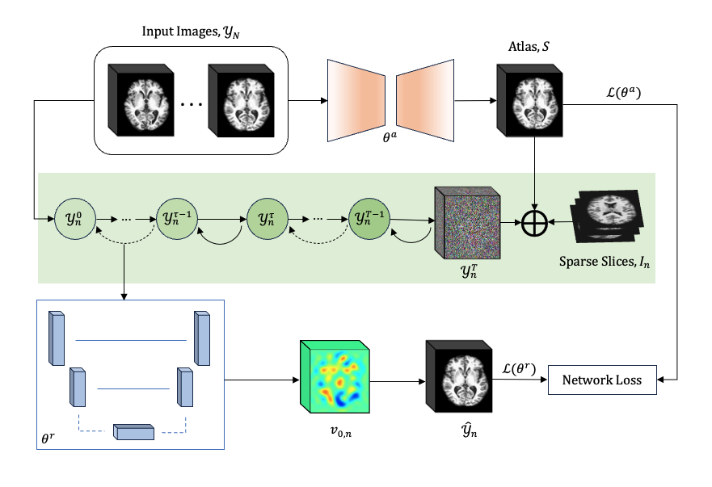

# SADIR: Shape-Aware Diffusion Models for 3D Image Reconstruction
This repository provides the PyTorch implementation of the paper: [SADIR: Shape-Aware Diffusion Models for 3D Image Reconstruction](https://arxiv.org/abs/2309.03335)

### Abstract:
3D image reconstruction from a limited number of 2D images has been a long-standing challenge in computer vision and image analysis. While deep learning-based approaches have achieved impressive performance in this area, existing deep networks often fail to effectively utilize the shape structures of objects presented in images. As a result, the topology of reconstructed objects may not be well preserved, leading to the presence of artifacts such as discontinuities, holes, or mismatched connections between different parts. In this paper, we propose a shape-aware network based on diffusion models for 3D image reconstruction, named SADIR, to address these issues. In contrast to previous methods that primarily rely on spatial correlations of image intensities for 3D reconstruction, our model leverages shape priors learned from the training data to guide the reconstruction process. To achieve this, we develop a joint learning network that simultaneously learns a mean shape under deformation models. Each reconstructed image is then considered as a deformed variant of the mean shape. We validate our model, SADIR, on both brain and cardiac magnetic resonance images (MRIs). Experimental results show that our method outperforms the baselines with lower reconstruction error and better preservation of the shape structure of objects within the images.

### Citation:
If you use our code, please cite: \
            @misc\{jayakumar2023sadir, \
                  title={SADIR: Shape-Aware Diffusion Models for 3D Image Reconstruction}, \
                  author={Nivetha Jayakumar and Tonmoy Hossain and Miaomiao Zhang},\
                  year={2023},\
                  eprint={2309.03335},\
                  archivePrefix={arXiv},\
                  primaryClass={cs.CV}\
            \}

### Usage
##### Setup: 
- Lagomorph (https://github.com/jacobhinkle/lagomorph)
- PyTorch 1.12.0
- GCC 11.2.0
- CUDA 11.4.2
For training our model, please refer to the "training.ipynb" Jupyter notebook.
